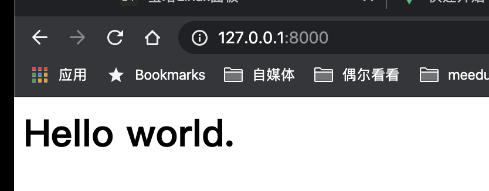

## 快速开始

```sh
mkdir -p templates/demo/frontend/index
vi templates/demo/frontend/index/index.blade.php
```

输入下面的内容：

```html
<h1>Hello MeEdu.</h1>
```

然后执行命令：

> 这里命令是将meedu的主题切换为 `demo` 。这里的 `demo` 就是上面的 `template/demo` 文件夹的名字。

```sh
php artisan template:switch demo
```

接着访问您的meedu首页（我这里是：http://127.0.0.1:8000）

我们就可以看到：


